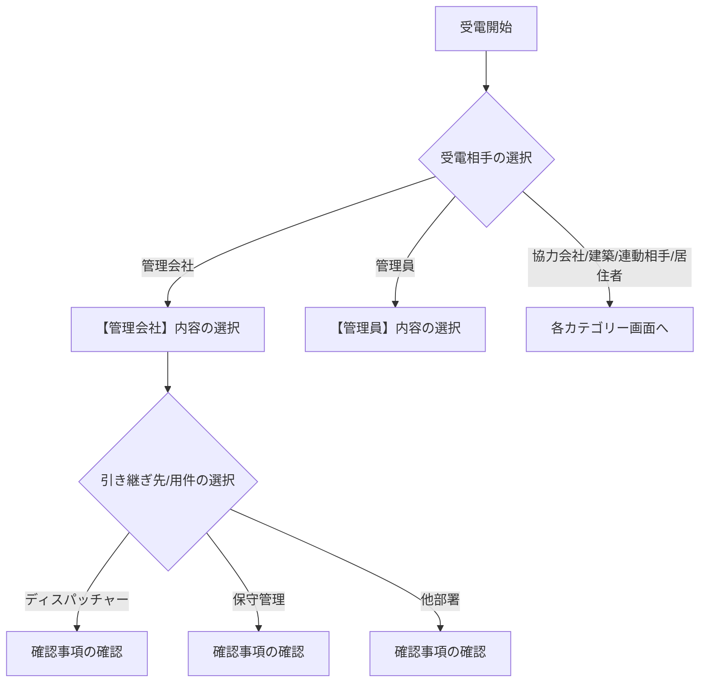

# 操作マニュアル：トークスクリプトフロー

本システムは、電話対応におけるヒアリング項目の確認、メモの作成、不通履歴の共有、および受電データの統計集計を行うためのアプリケーションです。

---

## 1. ログイン（サインイン）方法

### サインイン手順
1. **[Microsoft アカウントでサインイン]** ボタンをクリックします。
2. Microsoftのログイン画面に遷移しますので、サインインを行います。認証完了後、トークスクリプトの初期画面へ自動的に戻ります。

---

## 2. ユーザー機能

### 2.1 トークスクリプトフローの利用方法
電話がかかってきた際、相手に応じた適切なヒアリング項目（確認事項）を提示します。

1. **初期画面で受電相手を選択**: 
   * 画面中央の「受電相手を選択してください」から該当するカテゴリ（例：管理会社、管理員 など）をクリックします。
2. **引き継ぎ先・用件の選択**: 
   * 選択したカテゴリの下に紐づく引き継ぎ先（ディスパッチャー、保守管理、施工管理、他部署）および用件が表示されますので、相手の用件に合わせてクリックします。
3. **確認事項（ヒアリング）とメモ入力**: 
   * 画面右側に「確認ポイント（ヒアリング事項）」カードが表示されます。内容を確認しながらヒアリングを行ってください。確認事項の下部のメモ入力欄に用件をメモし、**[個人メモとして保存]** ボタンを押すと、自分専用の履歴としてメモが一時保存されます。

---

### 2.2 不通履歴（架電メモ）の登録と検索
折り返し電話をかけたが繋がらなかった（不通）場合、その情報を部署全体で瞬時に共有し、二重対応を防ぎます。

#### ① 不通の登録
* 画面最下部の「架電メモバー」の中央入力欄を使用します。
* **[電話番号]**（必須）、**[架電先氏名]**、**[号機/物件名]** を入力し、右側の **[不通]** ボタンをクリックします。
* 登録すると、不通情報がデータベースに保存され、部署内の全員が確認可能になります。

> [!NOTE]
> 保存から **24時間が経過した不通履歴は、一覧から自動的に削除** されます。常に最新の「本日対応すべき不通情報」のみが蓄積される仕様です。

#### ② 不通履歴の確認・検索
* 下部バーの **[履歴 (N)]** ボタン（Nは現在の未対応件数）をクリックすると、ポップアップで不通履歴一覧が表示されます。
* **高速検索窓**:
  * 一覧の上部にある検索窓に「物件名」「電話番号」「架電者（登録オペレーター名）」の一部を入力すると、即座にリストが絞り込まれます。
  * **電話番号のハイフン（`-`）の有無は無視**されるため、`090-1234-5678` と登録された履歴に対して `09012345678` と入力しても正しくヒットします。

#### ③ 対応完了（消し込み）処理
* 不通となっていた相手から折り返しが入るなどして対応が完了した場合は、履歴一覧から対応する項目のチェックボックス（または「完了」アクション）を押します。
* 完了処理を行うと、**その履歴は自動的に一覧および件数カウントから除外（非表示化）** されます。

---

## 3. トラブルシューティング

#### Q. ログイン画面で「Microsoft アカウントでサインイン」を押しても進まない
* A. ブラウザのポップアップブロックが有効になっている、またはサインインセッションが切れている可能性があります。ブラウザを一度完全に閉じ、キャッシュをクリアして再試行してください。

#### Q. 登録した不通履歴が消えてしまった
* A. 登録から24時間が経過した履歴、または誰かが「対応完了」にチェックを入れた履歴は、一覧から非表示になる仕様です。
